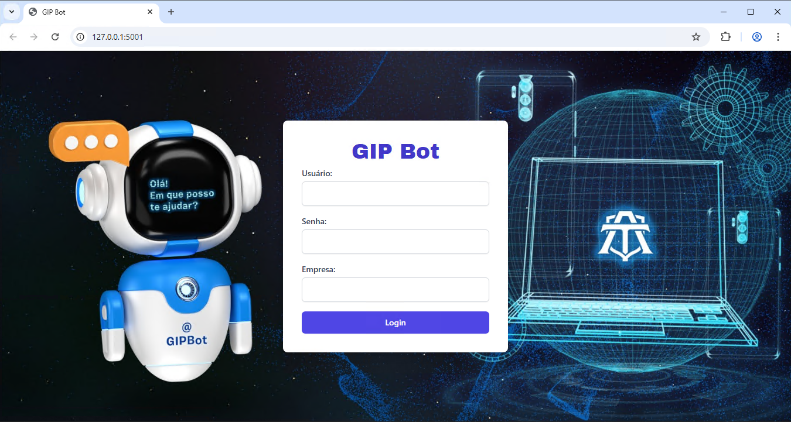
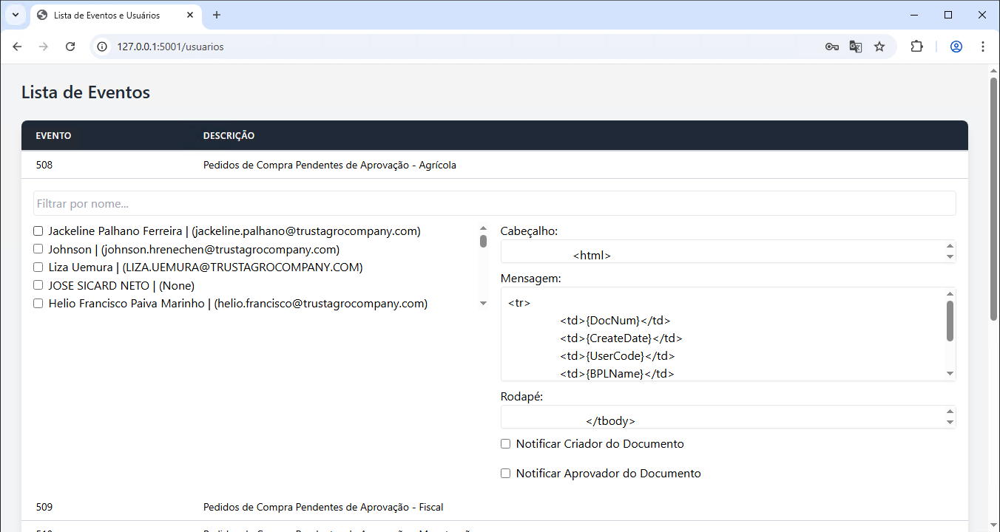

# 📬 GIP Bot - Sistema de Notificação de Eventos SAP

Este sistema web permite configurar e automatizar o envio de e-mails relacionados a eventos registrados no SAP, como pedidos de compra, solicitações e notas fiscais de entrada. Desenvolvido em Python com Flask, a aplicação permite selecionar usuários para notificação, customizar mensagens e gerenciar os eventos via interface web.

---

## 🧩 Estrutura do Projeto

```
├── app.py                  # Servidor Flask (rotas e inicialização da aplicação)
├── main.py                 # Execução das notificações (envio de e-mails)
├── conexao.py              # Conexão com banco SAP HANA e Service Layer
├── config.py               # Configurações da aplicação
├── dto.py                  # Definição de DTOs para comunicação com o banco
├── repositories.py         # Camada de acesso a dados (repositórios)
├── templates/              # Templates HTML do Flask
│   ├── index.html          # Página principal (lista de eventos e usuários)
│   └── login.html          # Página de login
├── static/                 # Recursos estáticos (imagens, CSS etc.)
│   ├── css/
│   │   ├── input.css       # Fonte original do CSS com Tailwind
│   │   └── output.css      # CSS gerado compilado pelo Tailwind
│   └── imgs/               # Imagens usadas no front-end
└── .venv/                  # Ambiente virtual Python
```

---

## 🚀 Como Executar

1. **Instale as dependências necessárias**:
   ```bash
   pip install flask hdbcli requests
   ```

2. **Configure as credenciais de e-mail no `main.py`**:
   ```python
   email_user = 'GIPBOT@trustagrocompany.com'
   email_pass = 'SUA_SENHA_AQUI'
   ```

3. **Rode a aplicação Flask**:
   ```bash
   python app.py
   ```

4. **Execute o disparo dos e-mails (ou agendando o arquivo pelo task scheduler)**:
   ```bash
   python main.py
   ```

---

## 🔐 Autenticação

A autenticação é feita via SAP Service Layer. O usuário precisa informar:
- Usuário SAP
- Senha
- Nome do Banco de Dados da Empresa (CompanyDB)

---

## 📋 Funcionalidades

- 🔒 **Login** com autenticação no SAP
- 👥 **Listagem de usuários e eventos**
- ✅ **Seleção de destinatários por evento**
- ✏️ **Edição de mensagens (cabeçalho, corpo, rodapé)**
- 📬 **Notificação automática de criador e aprovadores**
- 🔄 **Atualização persistente em banco via MERGE**

---

## 🗃️ Banco de Dados

A aplicação se comunica com tabelas auxiliares no banco HANA:

### `USUARIOS_SELECIONADOS`
Guarda os usuários que devem ser notificados por evento.

### `EVENTOS_MENSAGENS`
Armazena as mensagens customizadas para cada evento, além de flags para notificar criadores e aprovadores.

---

## 🛠️ Técnicas Utilizadas

- Flask (Web server)
- Jinja2 (templates HTML)
- SAP HANA DB (via `hdbcli`)
- SAP Service Layer (REST API)
- SMTP (envio de e-mails)
- TailwindCSS (estilo dos templates)

---

## 🔄 Lógica de Notificação (main.py)

Para cada evento SAP:
1. Vincula o a query criada dentro do gerenciador de consultas do SAP (Grupo Consultas de Email)
2. Executa a query SQL associada ao evento.
3. Monta a mensagem com placeholders substituídos (ex: `{UserName}`).
4. Busca os destinatários:
   - Selecionados via interface
   - Criador do documento
   - Aprovadores via mapeamento de departamentos
5. Envia o e-mail via SMTP com o conteúdo formatado.

---

## 📌 Notas

- ⚠️ **Atenção:** Evite subir esse projeto com credenciais sensíveis (e-mail e banco) em repositórios públicos.
- 🔐 As credenciais e endpoints do SAP devem estar devidamente configuradas no arquivo `conexao.py`.

---

## 📸 Telas

### Login


### Interface de Gestão

- Expandir eventos para configurar mensagens
- Selecionar usuários por checkbox
- Filtrar usuários por nome

---

## 📤 Futuras Melhorias

- Integração com log de envio
- Sistema de permissões para diferentes usuários
- Histórico de notificações
- Upload de templates HTML prontos

---

## 🧑‍💻 Autor

Desenvolvido por Bernardo da Silva Kropiwiec para automação de comunicação SAP na TrustAgro Company.

---
